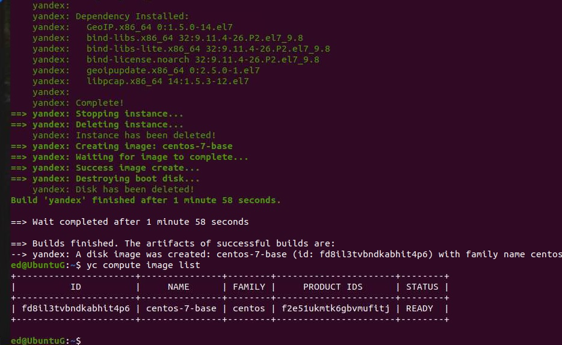

### Домашнее задание к занятию "5.4. Оркестрация группой Docker контейнеров на примере Docker Compose"
### Задача 1
Создать собственный образ операционной системы с помощью Packer.
  * Для получения зачета, вам необходимо предоставить:
 
Скриншот страницы, как на слайде из презентации (слайд 37).
05_04_01.jpg

### Задача 2
Создать вашу первую виртуальную машину в Яндекс.Облаке.
Для получения зачета, вам необходимо предоставить:
Скриншот страницы свойств созданной ВМ:
